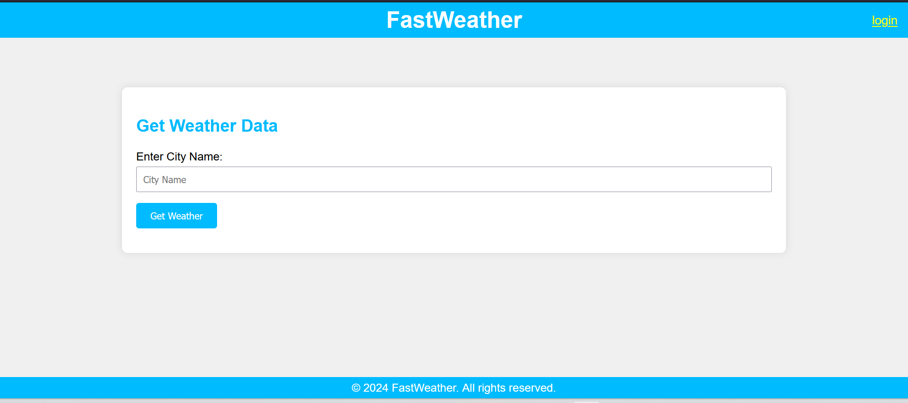
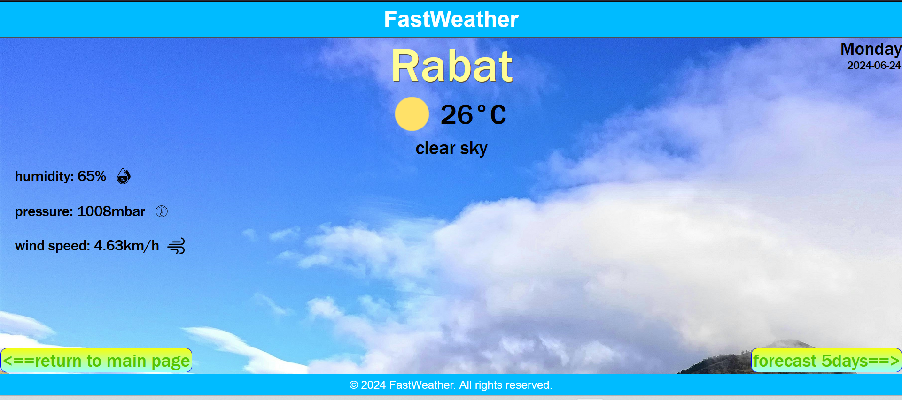
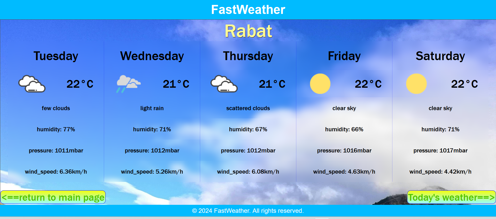

# FastWeather

FastWeather is a web application that provides quick and accurate weather updates for any location worldwide. Designed with simplicity and speed in mind, FastWeather delivers essential weather information in an intuitive interface.

## Table of Contents

1. [Installation](#installation)
2. [Usage](#usage)
3. [Features](#features)
4. [Contributing](#contributing)
5. [License](#license)
6. [Contact Information](#contact-information)

## Installation

To install FastWeather, follow these steps:

1. Clone the repository:
   ```sh
   git clone https://github.com/mar1fatih/FastWeather.git

2. Navigate to the project directory:
   ```sh
   cd FastWeather

3. Install the dependencies:
   ```sh
   pip install -r web_dynamic.requirements.txt

4. Start the application:
   ```sh
   python3 -m web_dynamic.index
   python3 -m api.v1.app

## Usage

To get your city's weather simply type the name of the city in the search box and click Get Weather button:


As you can see after typing the name of the city it will display the weather in details:


Also you can see the weather in the upcommig 5 days (forecast) if you clicked the forecast button:


## Features

- Real-time weather updates
- Search by city, state, or country
- Detailed weather forecasts
- Search history and favorite locations

## Contributing

We welcome contributions to FastWeather! To contribute:
- Fork the repository.
- Create a new branch:
   ```sh
   git checkout -b feature-branch
- Make your changes.
- Commit your changes:
   ```sh
   git commit -m 'Add new feature'
- Push to the branch:
   ```sh
   git push origin feature-branch
- Open a Pull Request.
